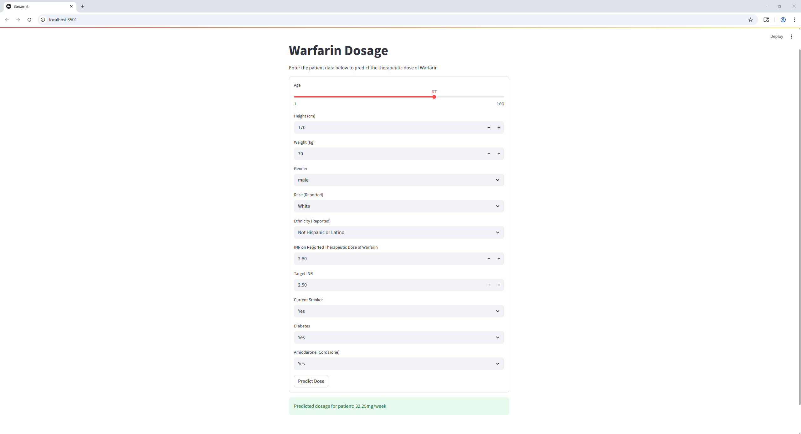

# Personalized Warfarin Dosage Recomender

A machine learning web app built with **scikit-learn** and **Streamlit** that predicts personalized therapeutic doses of Warfarin (a common blood thinner) based on clinical, demographic, and lifestyle data.

## Purpose

Warfarin is one of the most widely prescribed anticoagulant medications, and is used to prevent blood clots in patients with conditions such as 
- Atrial fibrillation (irregular heartbeat)
- Deep vein thrombosis
- Pulmonary embolism
- Mechanical heart valves

However, Warfarin has a very narrow therupeutic window. The correct dose for one patient can cause serious bleeding in another, or be completely ineffective, leading to life-threatening clots. Traditional Warfarin dosing methods use standard clinical guidelines or harmful trial-and-error adjustments. However, machine learning offers the potential to personalize dosing using patterns learned from large patient datasets.

## Overview

This app uses a trained **Random Forest Regressor** to provide data-driven dose estimates, helping show how AI can assist with peronalized medicine. It uses more than 29 patient features, preprocessing with scaling, encoding, and imputation, and saves/loads the movel using `joblib`. A graphical user interface is provided to the user through `streamlit`

## Demo



---

## Features

- Intelligent preprocessing: handles missing data, encodes categorical values, scales numerics
- Predicts Warfarin dose in **mg/week**
- Built-in model training & evaluation (MAE, RMSE, R²)
- Easy-to-use Streamlit interface for clinicians or patients

---

## 🛠️ Installation


### 1. Clone this repo
```bash
git clone https://github.com/yourusername/warfarin-dose-predictor.git
cd warfarin-dose-predictor
```
### 2. Set up Python environment
```bash
python -m venv .venv
source .venv/bin/activate  # On Windows: .venv\Scripts\activate
```
### 3. Install dependencies
```bash
pip install -r requirements.txt
```
### 4. Run the app
```bash
# Ensure `warfarin_data.xls` is in the `data/` folder
streamlit run app.py
```
